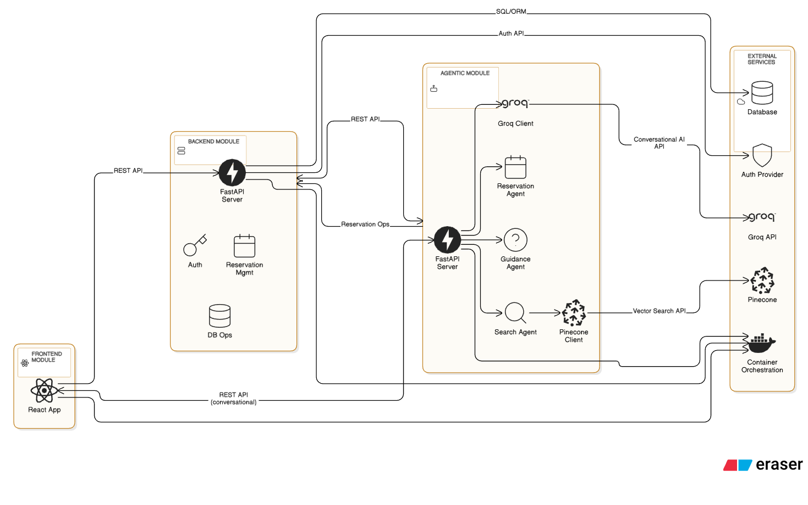

# GoodFoods Restaurant Reservation System

## Overview
**GoodFoods Restaurant Reservation System** is an AI-powered chatbot designed to make restaurant discovery and reservations seamless for both customers and restaurant operators. The system combines intelligent recommendationsand a conversational AI interface to create a smooth dining experience.

### Key Highlights

- **Personalized Recommendations:** Suggests restaurants based on user preferences, cuisine, location, and occasion.  
- **Seamless Reservations:** Enables users to book tables quickly and efficiently across multiple locations.  
- **Conversational AI Interface:** Guides users with natural, friendly conversation, helping them find the right restaurant without navigating complex menus.  


## Architecture

### Component Overview

The **GoodFoods Restaurant Reservation System** is built with a modular architecture to ensure scalability, maintainability and efficient communication between components. The system consists of three primary services:

1. **Agentic Module**  
   - Runs a FastAPI server exposing REST endpoints for AI interactions.  
   - Implements conversational AI using the Groq API.  
   - Contains specialized agents for restaurant search, reservation handling and user guidance.  
   - Manages vector-based search via Pinecone for quick, context-aware recommendations.

2. **Backend Module**  
   - FastAPI-based server managing core business logic.  
   - Handles user authentication, database operations and reservation management.  
   - Provides REST APIs for both the frontend and AI Agent Service.  
   - Ensures data consistency and secure communications between various services.

3. **Frontend Module**  
   - React application built with TypeScript and Tailwind CSS.  
   - Provides an intuitive, responsive interface for users on desktop and mobile devices.  
   - Interfaces with the backend for data operations and the AI Agent for conversational queries.  
   - Manages session states, user authentication, and interactive UI components.


# Architecture Diagram




## Project Structure
```
.
├── agents/                 # AI Agent Service
│   ├── Dockerfile
│   ├── app/
│   │   ├── __init__.py
│   │   ├── config.py          # Configuration settings
│   │   ├── core/
│   │   │   ├── __init__.py
│   │   │   ├── GoodFoods_agent.py  # Main agent logic
│   │   │   ├── restaurants.json     # Sample restaurant data, already loaded in Pinecone
│   │   │   ├── utils/
│   │   │   │   ├── __init__.py
│   │   │   │   ├── push_client.py
│   │   │   │   ├── llm_client.py
│   │   │   │   └── prompts.py
│   │   │   └── vector_store.py  # Functions to interact with Pinecone vector database
│   │   ├── main.py
│   │   ├── schemas.py
│   │   └── session_manager.py
│   └── requirements.txt  # Agent dependencies
├── backend/               # Backend Service
│   ├── Dockerfile
│   ├── app/
│   │   ├── auth.py        # Authentication logic
│   │   ├── activate.py    # Database operations
│   │   ├── database.py    # Database configuration
│   │   ├── init_db.py     # Database initialization
│   │   ├── main.py        # Backend entry point
│   │   ├── models.py      # Database models
│   │   ├── schemas.py     # Data validation schemas
│   │   └── seed.py        # Initial data seeding
│   └── requirements.txt   # Backend dependencies
├── frontend/              # React Frontend
│   ├── Dockerfile
│   ├── src/
│   │   ├── components/    # Reusable components
│   │   ├── pages/         # Application pages
│   │   └── context/       # Auth Context 
├── docker-compose.yml      # Docker Compose

```

## How to Setup 

### Before you begin, ensure you have:
- Docker 
- Groq API key
- Pinecone API key


1. **Clone the Repository**
   ```bash
   git clone [repository-url]
   cd GoodFoods
   ```

2. **Configure Environment**
   ```bash
   # Setup environment template
   .env

   # Add your Groq API key and Pinecone API key to .env
   GROQ_API_KEY=your_api_key_here
   PINECONE_API_KEY=your_api_key_here

   ```

3. **Start Docker**
   ```
   docker-compose build --no-cache
   ```

4. **Access the Application**
   - Frontend: [http://localhost:3000](http://localhost:3000) 
   - Backend : [http://localhost:8000/docs](http://localhost:8000/docs)
   - Agent : [http://localhost:8001/docs](http://localhost:8001/docs)


5. **Shutdown**
   ```bash
   Ctrl + C
   ```


# GoodFoodsBot Prompts

This module contains all the core prompt templates used by **GoodFoodsBot**, our AI assistant for restaurant recommendations and reservations. The prompts are designed to guide the LLM in understanding user intents, extracting reservation details, suggesting restaurants, and handling errors in a friendly and structured way.

---

## Table of Contents
1. [Overview](#overview)  
2. [Prompt Types](#prompt-types)  
3. [Key Design Principles](#key-design-principles)  
4. [Usage Examples](#usage-examples)  
5. [Extending the Prompts](#extending-the-prompts)  

---

## Overview

GoodFoodsBot interacts with users to:

- Suggest restaurants based on context and user preferences.  
- Extract reservation details (restaurant name, date, time, party size, confirmation).  
- Identify user intent (FIND_RESTAURANT, MAKE_RESERVATION, OTHER).  
- Ask for missing information in a conversational style.  
- Handle reservation errors and provide helpful feedback.

The prompts are carefully crafted to maintain **friendly, concise, and context-aware interactions** while strictly following the information available.

---

## Prompt Types

### 1. `similarity_search_filter_prompt`

Purpose: Extract **key terms and descriptors** from a user message to summarize intent without extra commentary.  

Key Features:
- Produces a single line output of keywords.
- Includes restaurant names if mentioned.
- Only considers the **latest user message**.
- Avoids making up details outside the context.

---

### 2. `find_restaurant_prompt`

Purpose: Recommend restaurants from available context.  

Key Features:
- Provides concise, 1–2 sentence suggestions.
- Handles vague queries by asking clarifying questions.
- Handles out-of-context queries by redirecting to available options.
- Structured output includes name, location, cuisine, price, and specialties.
- Family-friendly and dietary considerations included when relevant.

---

### 3. `intent_classifier_prompt`

Purpose: Classify the user’s intent into one of three categories:

- `FIND_RESTAURANT`  
- `MAKE_RESERVATION`  
- `OTHER`  

Key Features:
- Takes conversation history into account.
- Returns output in a strict JSON format.

---

### 4. `reservation_details_extraction_prompt`

Purpose: Extract reservation information from conversation history.  

Key Details Extracted:
- `restaurant_name`  
- `date` (YYYY-MM-DD)  
- `time` (HH:MM)  
- `party_size`  
- `has_user_confirmed` (boolean)

Key Features:
- Handles multiple mentions and updates.
- Marks missing or unclear details as `null`.
- Returns only structured JSON, no explanations.

---

### 5. `missing_reservation_details_prompt`

Purpose: Ask users for **missing reservation information** in a conversational, natural way.  

Key Features:
- Tailored questions for missing fields (`restaurant_name`, `date`, `time`, `party_size`, `has_user_confirmed`).
- Keeps questions concise and friendly.
- Ensures smooth dialogue flow without revealing missing-field logic.

---

### 6. `handle_reservation_error_prompt`

Purpose: Handle reservation errors or confirm successful bookings.  

Key Features:
- Explains errors in plain language, suggests next steps.
- Confirms successful reservations with details.
- Never exposes JSON or technical details to the user.
- Provides helpful, concise responses with next actions.

---

## Key Design Principles

1. **Context-Aware Responses**  
   - Always base answers on **available conversation or dataset context**.  
   - Avoid hallucinations or invented information.  

2. **Friendly & Human-Like Tone**  
   - Maintain approachable, polite, and helpful language.  

3. **Conciseness & Clarity**  
   - Keep messages short, structured, and easy to read.  

4. **Structured Outputs**  
   - Use JSON for intent and reservation data extraction.  
   - Ensures easy integration with downstream logic.  

5. **Extensibility**  
   - New prompts can follow existing patterns for uniformity.  

---

## Usage Examples

```python
from agents.app.core.utils.prompts import (
    find_restaurant_prompt,
    intent_classifier_prompt,
    reservation_details_extraction_prompt
)

# Example: Determine user intent
user_message = "I'd like to book a table at Azure for tomorrow evening."
intent_prompt = intent_classifier_prompt + f"\nUser: {user_message}"
# Send intent_prompt to LLM to get category

# Example: Extract reservation details
conversation_history = [
    "User: I'd like to book a table at Azure for tomorrow evening.",
    "Bot: Sure, for how many people?"
]
reservation_prompt = reservation_details_extraction_prompt + "\n" + "\n".join(conversation_history)

```

## Challenges and Known Issues

### Current Limitations

1. **Conversation Management**
   - Conversations are stored **in-memory** via [session_manager.py](agents/app/session_manager.py), limiting persistence across server restarts.
   - Tool parameter extraction may occasionally be inaccurate, causing mismatches in recommendations or reservations.
   - The language model occasionally misinterprets user intent or context, requiring further fine-tuning for better reliability.

2. **Authentication & Security**
   - Agent services currently have **basic authentication**, making them susceptible to misuse in multi-user environments.
   - System supports only a **single staff/admin user**, limiting scalability for operational management.
   - Administrative and access control features are minimal, requiring stronger role-based permissions.

3. **Data & Context Limitations**
   - Recommendations are strictly bound to the provided dataset; the model cannot infer or fetch external restaurant data.
   - Missing or ambiguous user input may require additional clarification, impacting conversation flow.

### Future Improvements

- **Voice Interaction:** Enable voice-based queries and responses for a hands-free user experience.
- **User Feedback & Ratings:** Integrate a feedback system to collect ratings for restaurant recommendations and reservations.
- **Enhanced LLM Model:** Upgrade to a more capable LLM for improved intent recognition, contextual understanding, and natural conversation handling.
- **Persistent Conversation Storage:** Implement database-backed conversation storage for better session continuity and analytics.
- **Advanced Authentication:** Add multi-user support with role-based access control, secure API keys, and session validation.
- **Dynamic Dataset Updates:** Allow seamless updates to restaurant data without requiring code changes or redeployment.


## 🎥 Video Demonstration

[](https://github.com/user-attachments/assets/d2b8ec65-991e-40e8-9bce-3c2497e57d13)


